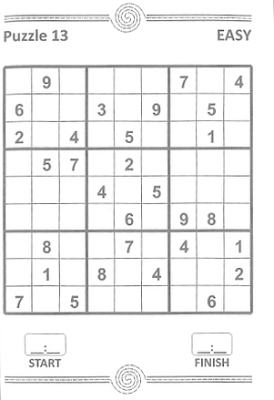
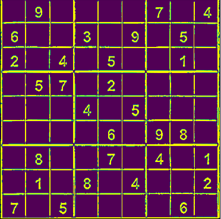
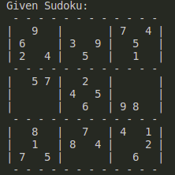
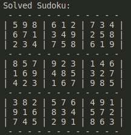

# Sudoku-Solver

Using computer vision toh solve the sudoku directly from the images. The project does not have a real life application as such but it's a great example of tasks which can be solved using machine learning and image processing.

## Requirements
` opencv-python==4.1.0.25`

` Keras>=2.2.5 (Keras-Applications>=1.0.8 and Keras-Preprocessing>=1.1.0) `

` Python3 `

## How to run the code

1. Clone the repository
2. Run main.py file with python3 and pass the image of sudoku as terminal argument

Example:

` python3 main.py ./Test_Images/image_1.jpg `

## Demo

1. It reads the image present in the given path. (An image from google images in this case)

2. Locates the sudoku in the image and removes the unnecessary portion of the image

3. Converts the image to numpy array using Machine Learning

4. Solves the sudoku matrix using backtracking

